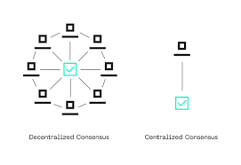
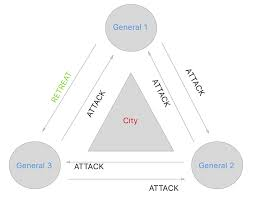
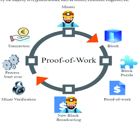
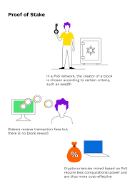
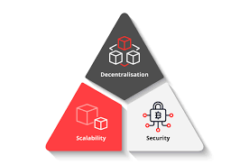

# Understanding Blockchain Consensus Mechanisms: A Beginner's Guide

In the world of blockchain and cryptocurrencies, you'll often hear the term "consensus mechanism" thrown around. But what exactly are these mechanisms, and why are they so important? This article breaks down consensus mechanisms in simple terms, explaining how they work and comparing the most popular types used today.

## What is a Consensus Mechanism?

A consensus mechanism is essentially a method that allows all participants in a blockchain network to agree on the current state of the system. Think of it as the rulebook that everyone follows to make decisions together.

Imagine you and your friends are keeping track of who owes who money in a shared notebook. How do you ensure nobody tampers with the records? In traditional systems, you might trust a single person (like a bank) to maintain this ledger. In blockchain, consensus mechanisms replace this central authority by creating rules that allow all participants to maintain and validate the ledger together.

## Why Do We Need Consensus Mechanisms?

Consensus mechanisms solve several critical problems:

1. **The Double-Spending Problem**: Preventing someone from spending the same digital money twice.
2. **Byzantine Generals' Problem**: Ensuring reliable agreement among distributed participants who might be malicious or faulty.
3. **Decentralized Trust**: Creating a trustworthy system without requiring a central authority.

## Popular Consensus Mechanisms

### Proof of Work (PoW)

**Used by**: Bitcoin, Litecoin, Dogecoin

Proof of Work is like a complex mathematical competition. Here's how it works:

1. Network participants (miners) compete to solve difficult computational puzzles.
2. The first to solve the puzzle gets to add a new block to the blockchain.
3. The solution is easily verifiable by others in the network.
4. The winner receives a reward (newly minted coins and transaction fees).

**Advantages**:
- Battle-tested security (Bitcoin has been running on PoW since 2009)
- Highly decentralized

**Disadvantages**:
- Energy-intensive (Bitcoin mining consumes as much electricity as some countries)
- Slower transaction processing (Bitcoin processes about 7 transactions per second)
- Potential for mining centralization due to specialized hardware requirements

### Proof of Stake (PoS)

**Used by**: Ethereum (since "The Merge"), Cardano, Solana, Avalanche

Instead of competing with computational power, Proof of Stake selects validators based on how many coins they "stake" or lock up as collateral.

1. Validators put up a stake (deposit) of the network's cryptocurrency.
2. The protocol randomly selects validators to create new blocks, with higher stakes increasing chances of selection.
3. If validators attempt to cheat, they lose part or all of their stake.

**Advantages**:
- Energy efficient (uses ~99.95% less energy than PoW)
- Can process transactions faster
- Encourages long-term holding of the cryptocurrency

**Disadvantages**:
- "Nothing at stake" problem (theoretical vulnerabilities)
- Potential for centralization if wealth concentrates among few participants
- Less battle-tested than PoW

### Delegated Proof of Stake (DPoS)

**Used by**: EOS, TRON, Lisk, BitShares

DPoS is like a representative democracy for blockchains:

1. Coin holders vote for delegates (also called witnesses or block producers).
2. A small number of delegates (typically 21-100) take turns producing blocks.
3. If delegates misbehave, voters can remove them.

Lisk, for example, uses a DPoS system where LSK token holders vote for 101 delegates who secure the network. These delegates take turns validating transactions and creating blocks, receiving rewards that they often share with their voters to incentivize continued support.

**Advantages**:
- Extremely fast transaction processing
- Highly scalable
- Energy efficient

**Disadvantages**:
- More centralized than traditional PoS or PoW
- Power can concentrate among a small group
- Potential for political issues in the voting process

### Practical Byzantine Fault Tolerance (PBFT)

**Used by**: Hyperledger Fabric, some enterprise blockchains

PBFT is based on all validators communicating with each other to confirm transactions:

1. One validator is temporarily chosen as a leader.
2. The leader proposes a block of transactions.
3. All validators communicate to establish consensus.
4. If a supermajority (typically 2/3) agrees, the block is added.

**Advantages**:
- No need for mining
- Instant finality (once confirmed, transactions cannot be reversed)
- Energy efficient

**Disadvantages**:
- Requires knowing the identity of network participants
- Limited scalability in terms of number of nodes
- High communication overhead

## Comparing Consensus Mechanisms

| Mechanism | Energy Usage | Transactions Per Second | Decentralization | Finality Time |
|-----------|-------------|------------------------|-----------------|--------------|
| Proof of Work | Very High | 7-30 | High | Minutes to hours |
| Proof of Stake | Low | 1,000-100,000+ | Medium-High | Minutes |
| Delegated PoS | Very Low | 3,000-100,000+ | Medium | Seconds |
| PBFT | Very Low | 1,000-10,000 | Low | Seconds |

## The Future of Consensus

Consensus mechanisms continue to evolve as developers seek the perfect balance between security, decentralization, and scalability (the "blockchain trilemma").

Newer approaches include:

- **Proof of History** (Solana): A way to create a historical record that proves events occurred at a specific time
- **Avalanche Consensus**: A metastable consensus protocol that combines elements of voting-based and Nakamoto consensus
- **Hybrid Models**: Combinations of different consensus mechanisms to leverage the advantages of each

## Conclusion

Consensus mechanisms are the beating heart of any blockchain network. They determine how fast transactions can be processed, how much energy the network consumes, and ultimately how secure and decentralized the system is.

As blockchain technology continues to mature, expect to see even more innovative approaches to consensus that push the boundaries of what's possible in decentralized systems.

Whether you're a cryptocurrency enthusiast, a potential investor, or just curious about blockchain technology, understanding these fundamental mechanisms will help you better evaluate different blockchain projects and their potential applications.
